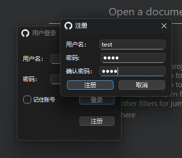
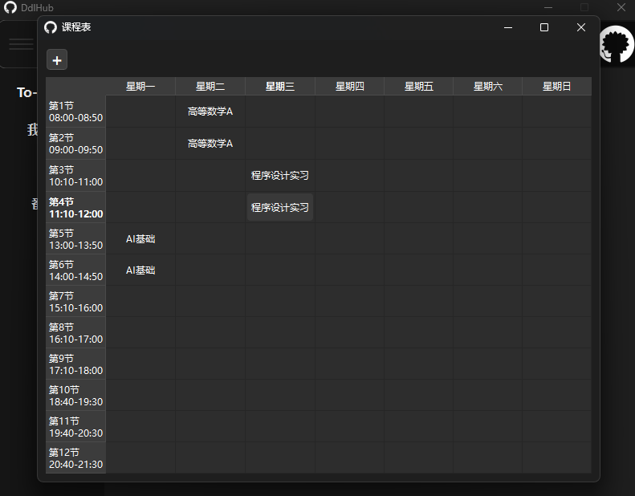
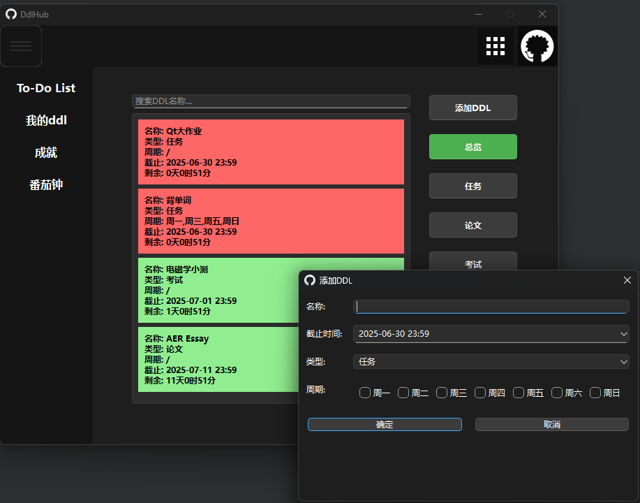
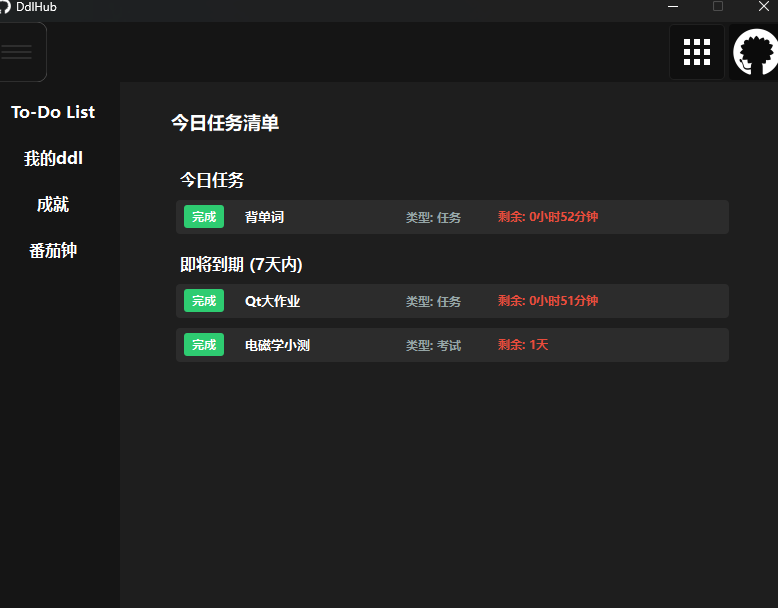

# DdlHub - 学习与任务管理助手

DdlHub 是一款基于 Qt 框架开发的本地学习与效率管理工具，集成了课程管理、任务规划、番茄工作法和成就系统，旨在帮助用户提升学习效率、合理安排时间。

## 🧩 核心功能

### 1. 身份管理

* 支持用户注册与登录功能
* 提供“记住密码”功能，提升使用便捷性
* 基于用户名验证的数据安全管理

### 2. 学习管理系统

* 提供清晰直观的 **可视化周课表**
* 支持课程信息的增删查改操作
* 实现课程时间冲突自动检测与提示

### 3. 任务管理系统

* 支持对 **DDL任务（作业/考试/论文）** 的录入与管理
* 自动归类任务为「今日任务」与「7天任务」
* 支持 **周期性任务**（如每周测验）的创建与调度
* 提供任务 **完成状态实时追踪** 与更新机制

### 4. 效率工具：番茄钟

* 实现 **可配置的工作/休息时长**
* 内置 **可视化环形进度条** 展示当前阶段
* 自动进行「工作-休息」阶段切换，支持持续专注模式

### 5. 成就系统

* 提供图标化的 **成就展示界面**，激励学习积极性
* 成就可根据特定条件自动解锁
* 用户可随时查看已解锁与未解锁成就状态

---

## 📷 界面预览







---

## 💻 技术栈

* C++ & Qt Framework
* 面向对象编程 + 信号槽机制

---


## 🚀 使用方式

1. 克隆本仓库：

   ```bash
   git clone https://github.com/yourusername/DdlHub.git
   ```
2. 使用 Qt Creator 打开 `.pro` 工程文件
3. 编译并运行，即可体验完整功能

---

## 🙌 演示视频

* https://disk.pku.edu.cn/link/AA709C90A112C44806BBA0633F0E970AAD
文件名：13-演示.mp4
有效期限：永久有效

---
